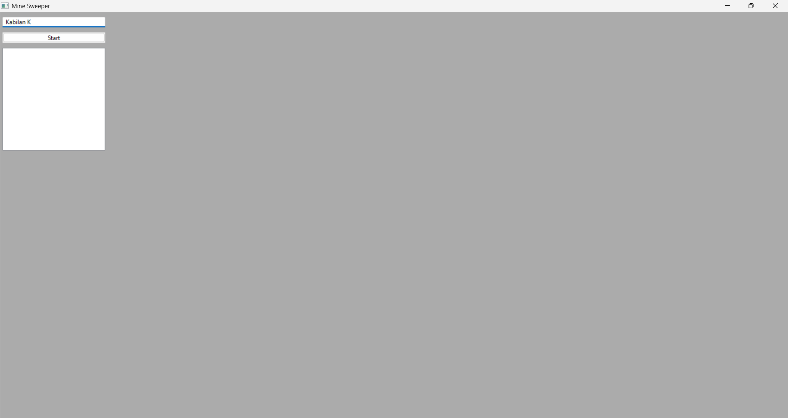

# wxWidgets MineSweeper (C++ GUI)

  

## 🚀 Overview
A desktop GUI implementation of the classic MineSweeper game, built to demonstrate **Event-Driven Programming** and **Object-Oriented Design** using the **wxWidgets** cross-platform framework.

Developed during my tenure as an **Associate Software Engineer Trainee** at **DEP**, this project served as a foundational exercise in understanding GUI layouts, event dispatching, and state management in C++.

## 📸 Screenshots
| Game Logger | Game Start | Game Over |
| :---: | :---: | :---: |
|  |  |  |

## 🔧 Key Technical Competencies
This project demonstrates the following C++ & GUI concepts:
* **Event Handling:** Utilization of `wxEvent` and dynamic event binding for interactive user inputs.
* **Layout Management:** Usage of **Sizers** (`wxGridSizer`, `wxBoxSizer`) to create responsive desktop interfaces.
* **Recursive Algorithms:** Implementation of **Flood Fill algorithms** to handle the "Zero-Adjacent" tile cascading logic.
* **OOP Architecture:** Separation of Game Logic (Model) from the Interface (View).

## 🛠️ Build Environment
**Original Development Stack:**
* **IDE:** Visual Studio 2019
* **Framework:** wxWidgets 3.1.4
* **Compiler:** MSVC v142

**Modern Build Support:**
Refactored to support **CMake** for cross-platform compatibility.

## 💻 How to Build
```bash
# 1. Create build directory
mkdir build && cd build

# 2. Configure (Ensure wxWidgets is in your environment path)
cmake ..

# 3. Build
cmake --build . --config Release

# 4. Run
./Release/MinesweeperApp.exe
